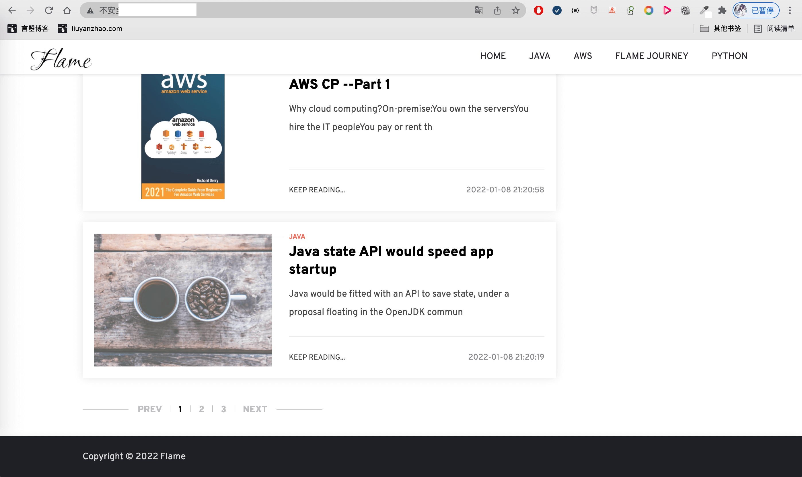
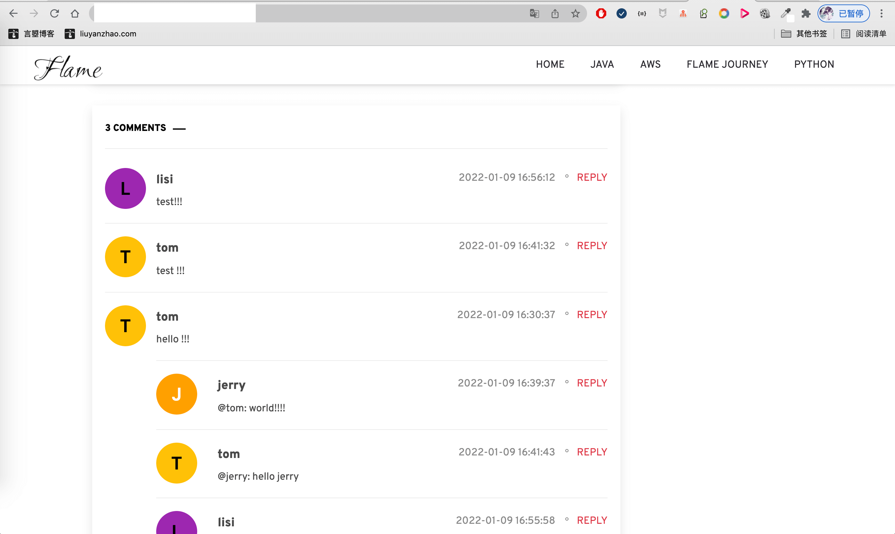
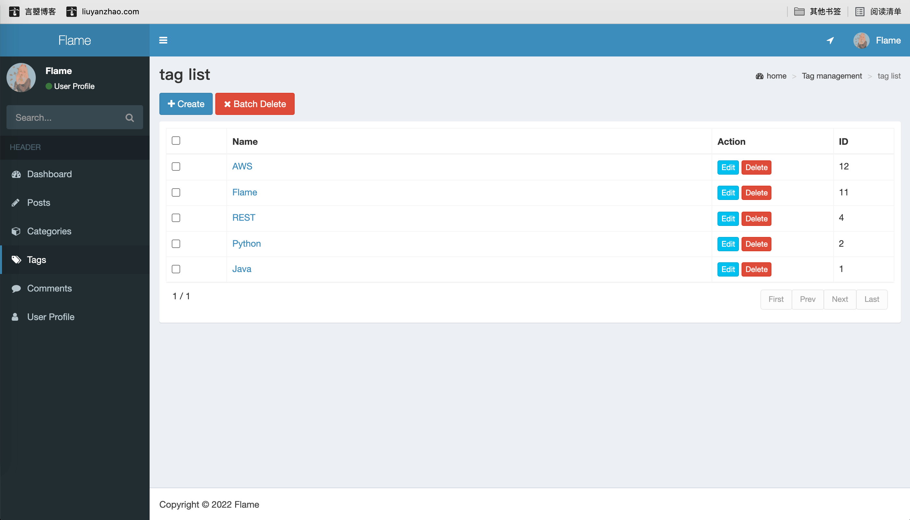

# SpringBoot博客
基于 SpringBoot 英文个人博客，轻量级博客 
详细说明：[http://liuyanzhao.com/shop/flame.html](http://liuyanzhao.com/shop/flame.html)  
预览地址：[http://flame.liuyanzhao.com](http://flame.liuyanzhao.com) 
升级版项目：[https://liuyanzhao.com/shop/recommendedblog.html]https://liuyanzhao.com/shop/recommendedblog.html) 

完成时间：2022年初 

## 特色
- 业务逻辑简单，代码简单，没有多余代码，方便二次开发和加功能
- 纯英文，留学生和Greek最爱

## 技术组成
- SpringBoot
- MyBatis/MyBatis Plus
- Thymeleaf
- MySQL
- Maven

## 预览
1-首页1.png

2-首页2.png

3-首页3.png

4-文章详情1.png

5-文章详情2.png

6-评论功能1.png

7-评论功能2.png

8-登录页面.png

9-文章管理.png

10-文章编辑1.png

11-文章编辑2.png

12-分类管理.png

13-标签管理.png

14-个人信息.png

## 联系方式
该项目可用于个人博客使用或，毕设等。  
长期更新！大家可以提需求，我可以及时更新！   
支持定制，加功能，减功能   
需要完整代码，联系本人，提供源码，远程部署和问题解答  
微信：847064370   
